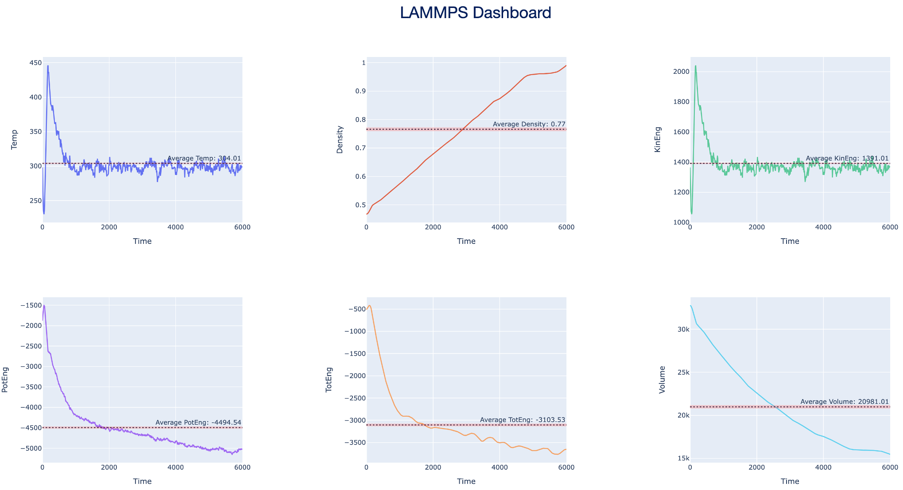
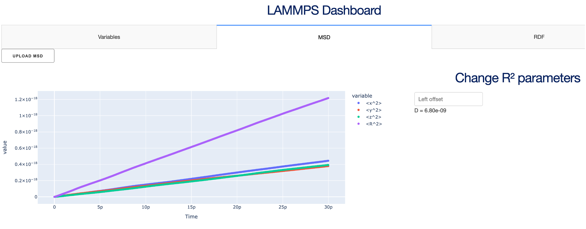
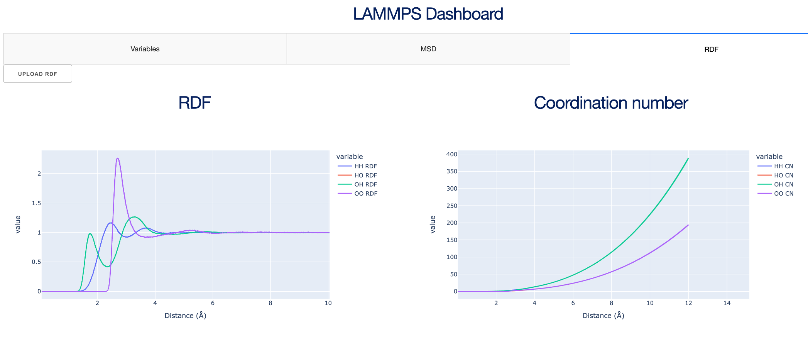

# LAMMPS Dashboard

This repository contains part of the work done for the Year 4 Group Project. All other relevant code files can be found in the main [project repository](https://github.com/Perosu1/WaterProject/).

## Project Aims
The aim of the project is to simulate water and the other hydrogen chalcogenides: H₂S, H₂Se, H₂Te and H₂Po, to demonstrate what makes water unique and important to life. A particular focus will be on examining nucleation of the Group 16 hydrides and applying quantum corrections to obtain more accurate thermodynamic data.

## Dashboard
### Aims
The simulations produce several output files, which contain data in the rectangular format with some other settings information. To focus more on the research and the meaning behind the data, this dashboard was created to automate: unit conversion, remove redundant data, plot graphs and calculate basic properties.

The dashboard can be launched as a web application in a web browser. The output files from the simulation could then be uploaded directly to the dashboard from the respective tab. Each plot is interactive and can be manipulated. Variables and MSD tabs allow to set the left offset, which would trim the beginning of the output files to ignore initial data, while the model is still stabilising.

The dashboard allowed to significantly increase productivity of the whole group, as the speed of analysis of the output data was improved, as visual interface for plotting was provided rather than using the command line. Additionally, data manipulation through the visual interface allowed to avoid manual data tidying with the text files. This approach overall improves the reproducibility of the research, as by analysing the code it is clear which manipulations were performed on the data.

### Tab 1: Variables
Output produces 6 plots generated from the log file. Each graph has an average value with average error plotted on the same graph. A table of processed data is produced below the plot. There is an option to enter a left offset, which will trim the beginning of the date in order to remove initial values. Since LAMMPS uses unconventional units for some of the measurements, unit conversion was also performed in the pre-processing step.

### Tab 2: MSD
Output shows the mean squared displacement (MSD) of the data with a field to enter the left offset. Unit conversion from unconventional to conventional units is also performed in the pre-processing step. The diffusion coefficient (D) is calculated from the R² value.

### Tab 3: RDF
Outputs the radial distribution function (RDF) and the coordination number (CN) of the simulation for all atom pairs.

## Data Structure
This section shows the data structure in the output files in the raw format.
> Note: Log and settings information present in some files has been omitted.

### log file
| Step | Time | Temp      | Density    | KinEng    | PotEng     | TotEng     | Volume    |
|------|------|-----------|------------|-----------|------------|------------|-----------|
| 0    | 0    | 318.15    | 0.94762053 | 1455.7091 | -3698.1782 | -2242.469  | 16163.242 |
| 10   | 10   | 320.85948 | 0.94760204 | 1468.1065 | -3710.6576 | -2242.5511 | 16163.557 |
| 20   | 20   | 328.34592 | 0.94756168 | 1502.361  | -3745.5163 | -2243.1553 | 16164.246 |

### MSD file
| # TimeStep | c_MSD[1]  | c_MSD[2]  | c_MSD[3]  | c_MSD[4] |
|------------|-----------|-----------|-----------|----------|
| 0          | 0         | 0         | 0         | 0        |
| 100        | 0.0775331 | 0.0784684 | 0.0806625 | 0.236664 |
| 200        | 0.161973  | 0.163087  | 0.164812  | 0.489872 |

### RDF file
| # Row     | c_RDF[1] | c_RDF[2] | c_RDF[3] | c_RDF[4] | c_RDF[5] | c_RDF[6] | c_RDF[7] | c_RDF[8] | c_RDF[9] |
|-----------|----------|----------|----------|----------|----------|----------|----------|----------|----------|
| 10000 500 |          |          |          |          |          |          |          |          |          |
| 1         | 0.012    | 0        | 0        | 0        | 0        | 0        | 0        | 0        | 0        |
| 2         | 0.036    | 0        | 0        | 0        | 0        | 0        | 0        | 0        | 0        |
